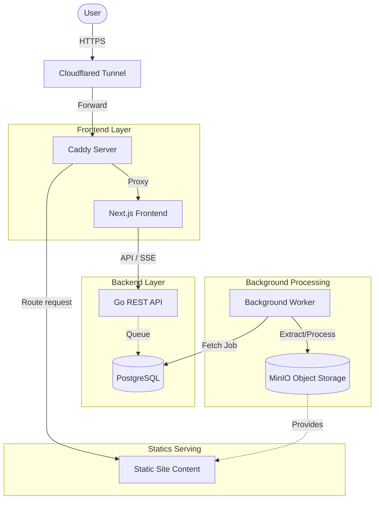

# Statify 🚀

Statify is a **personal, simple** static site management platform. It provides a lightweight but effective workflow to deploy, manage, and monitor static websites for personal projects and demos.

## ✨ Key Features

-   **Simplified Deployment**: Upload and deploy static sites via MinIO storage.
-   **Live Monitoring**: Basic site performance metrics delivered via Server-Sent Events (SSE).
-   **Project Organization**: Group deployments into projects for easier management.
-   **JWT Auth**: Simple authentication with role-based access control.
-   **Clean Dashboard**: A responsive interface built with Next.js and Shadcn UI.

## 🏗 Architecture

Statify architecture is designed for simplicity, leveraging background processing for file handling and Cloudflare for secure access.



### Infrastructure Workflow:
1.  **Cloudflared Tunnel**: Handles DNS, SSL termination, and provides a secure tunnel to the local environment.
2.  **Caddy**: Functions as an internal router and reverse proxy. It serves the Next.js frontend and routes requests to specific static site files.
3.  **Background Worker**: Periodically claims queued deployment jobs from PostgreSQL and performs file extraction/processing from/to MinIO.

## 🛠 Tech Stack

### Backend
-   **Language**: Go (Golang)
-   **Framework**: [Gin Gonic](https://gin-gonic.com/)
-   **Database**: PostgreSQL (GORM ORM)
-   **Storage**: MinIO (S3-compatible)
-   **Worker**: Background Goroutine-based processing
-   **Real-time**: SSE (Server-Sent Events)

### Frontend
-   **Framework**: [Next.js 15+](https://nextjs.org/)
-   **Styling**: Tailwind CSS 4 & Shadcn UI
-   **Charts**: Recharts
-   **Icons**: Lucide React

## 📂 Project Structure

```text
statify/
├── backend/
│   ├── cmd/api/main.go            # API Server entry point
│   ├── internal/
│   │   ├── app.go                 # App initialization & Dependency Injection
│   │   ├── core/                  # Shared types, error handling, SSE broker
│   │   │   ├── sse/               # SSE implementation
│   │   │   └── api-errors.go      # Centralized error management
│   │   ├── database/
│   │   │   ├── migrations/        # Goose SQL migrations
│   │   │   └── models/            # GORM database entities
│   │   ├── modules/               # Domain-driven modules
│   │   │   ├── auth/              # JWT & User identity
│   │   │   ├── project/           # Project management logic
│   │   │   └── deployment/        # Deployment lifecycle
│   │   │       ├── workers/       # Background extraction worker
│   │   │       └── service/       # File processing & logic
│   │   └── storage/minio/         # MinIO client wrapper
├── frontend/
│   ├── src/
│   │   ├── app/                   # Next.js App Router (Layouts & Pages)
│   │   │   ├── (main)/            # Dashboard & Protected routes
│   │   │   └── (auth)/            # Login & Registration
│   │   ├── features/              # Feature-based architecture
│   │   │   ├── deployments/       # Deployment components & API hooks
│   │   │   ├── projects/          # Project list & creation logic
│   │   │   └── analytics/         # Charts & Metrics visualization
│   │   ├── components/ui/         # Shadcn reusable UI components
│   │   └── lib/                   # Shared utilities (fetch, formatting)
└── caddy/                         # Caddyfile for local routing
```

## 🚀 Getting Started

### Prerequisites
-   Go 1.22+
-   Node.js 20+
-   Docker (for infra)
-   Cloudflared (optional, for remote access)

### Local Dev Setup

1.  **Infrastructure**: `docker-compose up -d` (Postgres, MinIO)
2.  **Backend**: `cd backend && go run cmd/api/main.go`
3.  **Frontend**: `cd frontend && npm i && npm run dev`

## 📜 API Documentation

Interactive Swagger docs available at: `http://localhost:8000/api/v1/swagger`

---
Built by [gianghp](https://github.com/gianghp)
